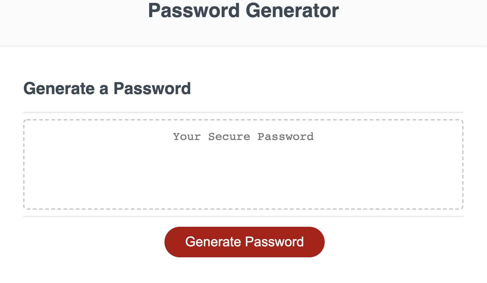

# Password-Generator

## Description

This project emphasizes the use of Javascript to generate a random, secure password for the user. 

When the user clicks the button "Generate Password" they are first promoted for password length. If the range is outside of 8-128, the user is prompted to once again ebter a password length within the range.

The program then prompts the user to define if they would like to include numbers, symbols, lowercase and/or lowercase letters.

If the user selects none to all password criteria, the program will ask to slect at least one.

The user will be prompted to choose from the following password criteria:

- Length (must be between 8 and 128 characters)

- Character type:
    - Numberic characters (0, 1, 2, 3, 4, 5, 6, 7, 8, 9)
    - Symbol characters (!, @, #, $, %, ^, &, *, ?)
    - Lowercase characters (a, s, d, f, g, h, j, k, l)
    - Uppercase characters (A, S, D, F, G, H, J, K, L)

## Below is the password generator demo:
[Password Generator Link](https://ctinengyn.github.io/Password-Generator/)

